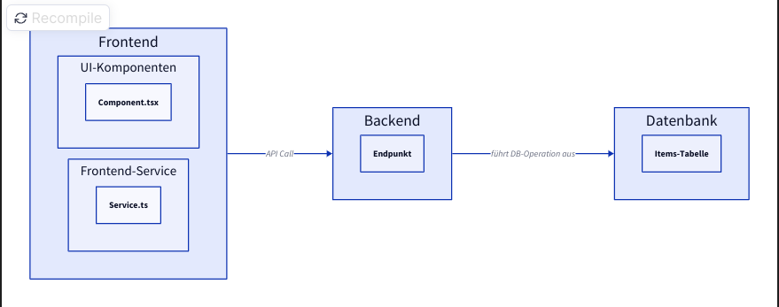

# 🖼️ Online Museum

Ein digitales Museum, das Benutzern ermöglicht, kulturelle und kreative Inhalte zu sammeln, zu organisieren und zu teilen. Die Plattform bietet **private und öffentliche Sammlungen** und **redaktionelle Inhalte**.

---

## 🏗️ Technologie-Stack

### Frontend

* React 18 + TypeScript
* Tailwind CSS
* Tremor UI-Komponenten
* React Router
* Notyf (Benachrichtigungen)

### Backend

* Node.js mit Express
* PostgreSQL
* JWT für Authentifizierung
* Multer für Datei-Uploads
* bcrypt für Passwort-Hashing

### KI-Integration

* Mistral AI für automatische Beschreibungen
* Geplante automatische Kategorisierung

---

## 📋 Voraussetzungen

* Node.js (v18+)
* (Docker & Docker Compose)
* Git

---

## 🚀 Installation & Setup

### Docker Compose als einfache Alternative, ansonsten ab Schritt 1 folgen

```bash
#Projekt herunterladen
git clone https://github.com/niklaherr/online-museum.git
cd online-museum

# Alle Services starten
docker-compose up -d

# Logs anzeigen
docker-compose logs -f
```

### 1. Repository klonen

```bash
git clone https://github.com/niklaherr/online-museum.git
cd online-museum
```

### 2. Datenbank starten
```bash
cd db
docker build -t online-museum-db .
docker run --name museum-db -dp 5432:5432 \
  -e POSTGRES_USER=user \
  -e POSTGRES_PASSWORD=password \
  -e POSTGRES_DB=mydatabase \
  online-museum-db
```
Wenn die PostgreSQl-Datenbank nicht über Docker gestartet werden sollen, müssen die Daten für die Verbindung zur Datenbank im Backend angepasst werden. Die Datei ist zu finden unter /backend/.env Wenn die Dockerfile nicht verwendet wird, dann muss ebenfalls die /db/init_db.sql Datei als Initialisierungsskript der Datenbank ausgeführt werden.

### 3. Backend starten

```bash
cd backend
npm install
node server.js
```

### 4. Frontend starten

```bash
cd backend
npm install
npm start
```

**Zugänglichkeit:**

* Frontend: `http://localhost:3000` -> `http://localhost:8080` bei der Nutzung von Docker Compose
* Backend: `http://localhost:3001`
* DB: `localhost:5432`

## 🎮 Verwendung

### Erste Schritte

1. Registrierung: `http://localhost:3000 oder http://localhost:80 → Registrieren`
2. Profil anlegen: Benutzername & Passwort
3. Sicherheitsfrage ausfüllen
4. Erstes Item hochladen
5. Eigene Liste erstellen

### Admin-Zugang aktivieren

1. Mit dem Nutzer adminuser und dem Passwort 1234567 anmelden
2. Den selbst erstellten Nutzer als Admin hinzufügen und dann den adminuser löschen über die normale Löschfunktion

### KI-Funktionen nutzen

* Bei Item oder Item Listen Erstellung auf **"KI-Beschreibung generieren"** klicken
---

## Architektur


Weitere Informationen findest du .


## 📚 Dokumentation - Frontend

Ein React basiertes Frontend.
Weitere Informationen findest du innerhalb der [Erklärung des Frontends](./documentation/frontend.md).


## 📚 API-Dokumentation - Backend

Ein Express.js-basiertes Backend.
Weitere Informationen findest du innerhalb der [Erklärung des Backends](./documentation/backend.md).


## 📚 Präsentationsfolien

Folien der Präsentation über Arbeitsweise, Architektur, Herausforderungen und Lessons Learned.
Weitere Informationen findest du innerhalb der [Präsentationsfolien](./documentation/Effiziente-Entwicklung-mit-React-and-Scrum (1).pdf).

## 🚀 Deployment über Railway (Docker + öffentliche URLs)
Diese Anwendung wird über [Railway](https://railway.com/) gehostet. Jede Komponente läuft in einem eigenen Docker-Container und wird als separater Railway-Service bereitgestellt. Die Kommunikation zwischen den Services erfolgt über die von Railway automatisch generierten öffentlichen URLs. Der genaue Aufbau wird im Verteilungsdiagramm dargestellt.


## 🆘 Support

* 📘 Doku: Diese README
* 🐞 Bugs: GitHub Issues

---

## 📊 Projektstatistiken

* Erste Version: **Mai 2025**
* Aktive Entwicklung: ✅
* Letztes Update: **Juni 2025**
* Contributors: **3+** – ❤️
