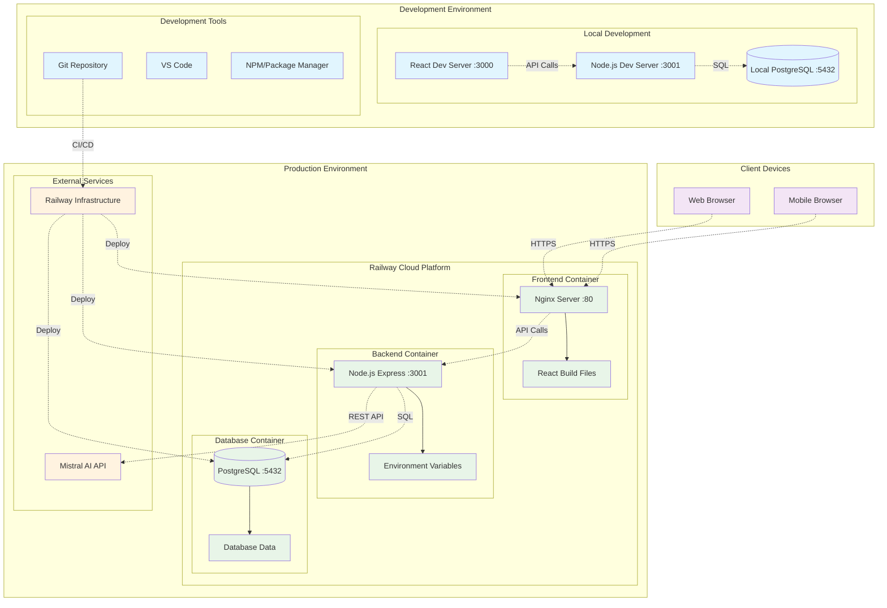
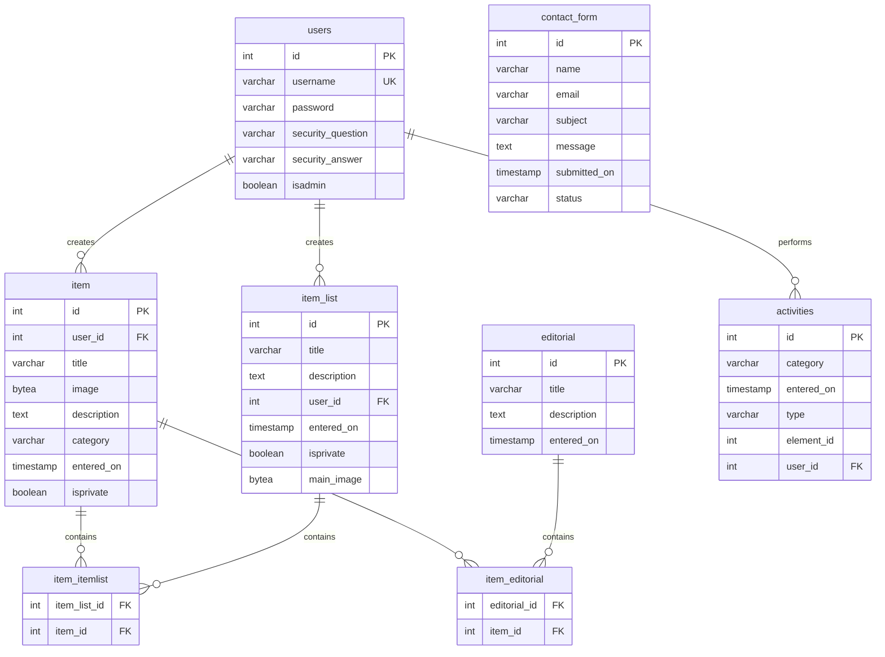

# Online-Museum: Anwendungsfall- und Architekturdiagramme

## 📋 Inhaltsverzeichnis

1. [Anwendungsfalldiagramm](#1-anwendungsfalldiagramm)
2. [Systemarchitektur-Diagramm](#2-systemarchitektur-diagramm)
3. [Komponentendiagramm](#3-komponentendiagramm)
4. [Verteilungsdiagramm (Deployment)](#4-verteilungsdiagramm-deployment)
5. [Klassendiagramm (Backend Services)](#5-klassendiagramm-backend-services)
6. [Datenbankschema](#6-datenbankschema)
7. [Beschreibung der Anwendungsfälle](#beschreibung-der-anwendungsfälle)

---

## 1. Anwendungsfalldiagramm

```mermaid
graph TB
    subgraph "Online-Museum System"
        subgraph "Authentifizierung"
            UC1[Registrieren]
            UC2[Anmelden]
            UC3[Passwort zurücksetzen]
            UC4[Profil verwalten]
        end
        
        subgraph "Item-Management"
            UC5[Item erstellen]
            UC6[Items anzeigen]
            UC7[Item bearbeiten]
            UC8[Item löschen]
            UC9[Items durchsuchen]
        end
        
        subgraph "Listen-Management"
            UC10[Item-Liste erstellen]
            UC11[Item-Liste bearbeiten]
            UC12[Item-Liste löschen]
            UC13[Listen durchsuchen]
        end
        
        subgraph "Administration"
            UC14[Redaktionelle Listen verwalten]
            UC15[Benutzer-Adminrechte verwalten]
            UC16[Support-Anfragen bearbeiten]
        end
        
        subgraph "KI-Features"
            UC17[KI-Beschreibung generieren]
        end
        
        subgraph "Support"
            UC18[Kontakt-Formular senden]
            UC19[Hilfe-Seiten anzeigen]
        end
    end
    
    subgraph "Akteure"
        Guest[Gast]
        User[Registrierter Benutzer]
        Admin[Administrator]
    end
    
    %% Gast-Beziehungen
    Guest --> UC1
    Guest --> UC2
    Guest --> UC3
    Guest --> UC6
    Guest --> UC18
    Guest --> UC19
    
    %% Benutzer-Beziehungen (erbt von Gast)
    User --> UC4
    User --> UC5
    User --> UC7
    User --> UC8
    User --> UC9
    User --> UC10
    User --> UC11
    User --> UC12
    User --> UC13
    User --> UC17
    
    %% Admin-Beziehungen (erbt von Benutzer)
    Admin --> UC14
    Admin --> UC15
    Admin --> UC16
    
    %% Vererbungsbeziehungen
    User -.-> Guest
    Admin -.-> User
```

**Beschreibung**: Dieses Diagramm zeigt alle Hauptfunktionen des Online-Museums und deren Zuordnung zu den drei Benutzerrollen. Es visualisiert die Vererbungsbeziehungen zwischen Gast, registriertem Benutzer und Administrator, sowie die verschiedenen Funktionsbereiche wie Authentifizierung, Item-Management, Listen-Verwaltung und Administration.

---

## 2. Systemarchitektur-Diagramm

```mermaid
graph TB
    subgraph "Client-Schicht (Frontend)"
        React[React.js Application]
        
        subgraph "React Components"
            Pages[Pages]
            Components[Components]
            Services[Services]
        end
        
        subgraph "UI Libraries"
            Tremor[Tremor UI]
            Tailwind[Tailwind CSS]
            Framer[Framer Motion]
        end
        
        React --> Pages
        React --> Components
        React --> Services
        Pages --> Tremor
        Components --> Tailwind
        Components --> Framer
    end
    
    subgraph "Server-Schicht (Backend)"
        Express[Express.js Server]
        
        subgraph "Routes"
            AuthRoutes[Auth Routes]
            ItemRoutes[Item Routes]
            ListRoutes[List Routes]
            AdminRoutes[Admin Routes]
        end
        
        subgraph "Middleware"
            AuthMiddleware[JWT Authentication]
            SecurityMiddleware[SQL Injection Protection]
            CorsMiddleware[CORS Middleware]
        end
        
        subgraph "Services"
            ActivityService[Activity Service]
            InjectionService[Injection Service]
        end
        
        Express --> AuthRoutes
        Express --> ItemRoutes
        Express --> ListRoutes
        Express --> AdminRoutes
        Express --> AuthMiddleware
        Express --> SecurityMiddleware
        Express --> CorsMiddleware
        Express --> ActivityService
        Express --> InjectionService
    end
    
    subgraph "Datenbank-Schicht"
        PostgreSQL[(PostgreSQL Database)]
        
        subgraph "Tabellen"
            Users[users]
            Items[item]
            ItemLists[item_list]
            Editorial[editorial]
            Activities[activities]
            ContactForm[contact_form]
        end
        
        PostgreSQL --> Users
        PostgreSQL --> Items
        PostgreSQL --> ItemLists
        PostgreSQL --> Editorial
        PostgreSQL --> Activities
        PostgreSQL --> ContactForm
    end
    
    subgraph "Externe Services"
        MistralAPI[Mistral AI API]
        FileStorage[File Storage System]
    end
    
    %% Verbindungen zwischen Schichten
    React -.->|HTTP/REST| Express
    Express -.->|SQL Queries| PostgreSQL
    Express -.->|API Calls| MistralAPI
    Express -.->|File Operations| FileStorage
    
    %% Styling
    classDef frontend fill:#e1f5fe
    classDef backend fill:#f3e5f5
    classDef database fill:#e8f5e8
    classDef external fill:#fff3e0
    
    class React,Pages,Components,Services,Tremor,Tailwind,Framer frontend
    class Express,AuthRoutes,ItemRoutes,ListRoutes,AdminRoutes,AuthMiddleware,SecurityMiddleware,CorsMiddleware,ActivityService,InjectionService backend
    class PostgreSQL,Users,Items,ItemLists,Editorial,Activities,ContactForm database
    class MistralAPI,FileStorage external
```

**Beschreibung**: Diese 3-Schichten-Architektur zeigt die technische Struktur des Systems. Die Client-Schicht (React Frontend) kommuniziert über REST-APIs mit der Server-Schicht (Express.js Backend), welche wiederum mit der Datenbank-Schicht (PostgreSQL) und externen Services (Mistral AI) interagiert. Middleware-Komponenten sorgen für Sicherheit und Authentifizierung.

---

## 3. Komponentendiagramm

**Beschreibung**: Dieses Diagramm stellt die detaillierte Komponentenstruktur dar, von Frontend-UI-Komponenten über Service-Layer bis zu Backend-APIs. Es zeigt die Abhängigkeiten zwischen React-Komponenten, TypeScript-Services und REST-Endpunkten. Die Darstellung kann bei der komplexen Vernetzung in GitHub abgeschnitten werden - in diesem Fall die Services als zentrale Vermittler zwischen Frontend und Backend verstehen.

```mermaid
graph TD
    subgraph "Frontend Layer"
        subgraph "UI Components"
            Header[Header - Navigation & User Menu]
            Sidebar[Sidebar - Main Navigation]
            Footer[Footer - Legal Links]
            Dashboard[Dashboard - Overview & Stats]
            Gallery[Gallery - Item Browse & Search]
            ItemList[ItemList - Collection Views]
            Auth[Auth Pages - Login/Register]
            Admin[Admin Pages - User & Content Management]
        end
        
        subgraph "Feature Components"
            CreateItem[CreateItem - Upload & Metadata]
            EditItem[EditItem - Item Modification]
            CreateList[CreateItemList - Collection Creation]
            EditList[EditItemList - Collection Management]
        end
        
        subgraph "Utility Components"
            Loading[Loading - Spinner Component]
            NoResults[NoResults - Empty State]
            NotFound[NotFound - 404 Page]
        end
    end
    
    subgraph "Service Layer"
        UserService[UserService - Auth & Profile]
        ItemService[ItemService - CRUD Operations]
        EditorialService[EditorialService - Curated Content]
        AdminService[AdminService - User Management]
        ContactService[ContactFormService - Support]
        AIService[ItemAssistantService - AI Integration]
        NotifyService[NotyfService - Notifications]
    end
    
    subgraph "Backend API"
        AuthAPI[Auth Endpoints - /auth/*]
        ItemAPI[Item Endpoints - /items/*]
        ListAPI[List Endpoints - /item-lists/*]
        EditorialAPI[Editorial Endpoints - /editorial/*]
        AdminAPI[Admin Endpoints - /admin/*]
        ContactAPI[Contact Endpoints - /contact-form/*]
    end
    
    subgraph "External APIs"
        MistralAI[Mistral AI - Description Generation]
    end
    
    %% Component Dependencies
    Dashboard --> UserService
    Dashboard --> ItemService
    Gallery --> ItemService
    ItemList --> ItemService
    Auth --> UserService
    Admin --> AdminService
    CreateItem --> ItemService
    CreateItem --> AIService
    
    %% Service to API Mapping
    UserService --> AuthAPI
    ItemService --> ItemAPI
    ItemService --> ListAPI
    EditorialService --> EditorialAPI
    AdminService --> AdminAPI
    ContactService --> ContactAPI
    AIService --> MistralAI
    
    %% Error Handling
    UserService --> NotifyService
    ItemService --> NotifyService
    EditorialService --> NotifyService
```

---

## 4. Verteilungsdiagramm (Deployment)

**Beschreibung**: Das Deployment-Diagramm zeigt die Infrastruktur-Architektur des Systems. In der Production-Umgebung läuft alles auf Railway Cloud Platform mit separaten Containern für Frontend (Nginx), Backend (Node.js) und Datenbank (PostgreSQL). Die Entwicklungsumgebung spiegelt diese Struktur lokal wider. CI/CD-Pipeline automatisiert den Deployment-Prozess.

---

## 5. Klassendiagramm (Backend Services)

**Beschreibung**: Das Klassendiagramm visualisiert die objektorientierte Struktur der TypeScript-Services im Frontend. Jeder Service kapselt spezifische Geschäftslogik und API-Aufrufe. Die Abhängigkeiten zeigen, dass alle Services den NotyfService für Benachrichtigungen und den UserService für Authentifizierung nutzen. Jeder Service folgt dem Single-Responsibility-Prinzip.

---

## 6. Datenbankschema

**Beschreibung**: Das Entity-Relationship-Diagramm stellt die PostgreSQL-Datenbankstruktur dar. Zentrale Entitäten sind `users`, `item` und `item_list` mit ihren Beziehungen. Many-to-Many-Beziehungen werden über Verbindungstabellen (`item_itemlist`, `item_editorial`) abgebildet. Das Schema unterstützt sowohl private Nutzersammlungen als auch öffentliche redaktionelle Inhalte.

---

## Beschreibung der Anwendungsfälle

### 🎭 Hauptakteure

- **Gast**: Nicht angemeldeter Benutzer mit eingeschränkten Rechten
- **Registrierter Benutzer**: Angemeldeter Benutzer mit vollen Funktionen
- **Administrator**: Benutzer mit erweiterten Verwaltungsrechten

### 🚀 Kern-Anwendungsfälle

#### 1. **Authentifizierung & Benutzerverwaltung**
- **UC1 - Registrieren**: Neuen Account mit Sicherheitsfrage erstellen
- **UC2 - Anmelden**: Login mit JWT-Token-basierter Authentifizierung
- **UC3 - Passwort zurücksetzen**: Reset über Sicherheitsfrage ohne E-Mail
- **UC4 - Profil verwalten**: Account-Einstellungen und Passwort ändern

#### 2. **Item-Management**
- **UC5 - Item erstellen**: Upload von Bildern mit Metadaten und KI-Beschreibung
- **UC6 - Items anzeigen**: Browse-Funktionalität mit Kategoriefiltern
- **UC7 - Item bearbeiten**: Aktualisierung von Metadaten und Bildern
- **UC8 - Item löschen**: Sichere Entfernung mit Cascading-Löschung
- **UC9 - Items durchsuchen**: Volltext-Suche über Titel, Kategorien und Beschreibungen

#### 3. **Listen-Management**
- **UC10 - Item-Liste erstellen**: Thematische Sammlungen mit Banner-Bildern
- **UC11 - Item-Liste bearbeiten**: Aktualisierung von Listen-Metadaten
- **UC12 - Item-Liste löschen**: Entfernung von Listen (Items bleiben erhalten)
- **UC13 - Listen durchsuchen**: Suche und Filter für öffentliche/private Listen

#### 4. **Administration**
- **UC14 - Redaktionelle Listen verwalten**: Kuratierte Empfehlungssammlungen
- **UC15 - Benutzer-Adminrechte verwalten**: Rollenverwaltung und Rechtezuweisung
- **UC16 - Support-Anfragen bearbeiten**: Ticketing-System für Benutzerhilfe

#### 5. **Erweiterte Features**
- **UC17 - KI-Beschreibung generieren**: Mistral AI-Integration für Content-Generation
- **UC18 - Kontakt-Formular senden**: Support-Anfragen von Benutzern
- **UC19 - Hilfe-Seiten anzeigen**: Dokumentation und FAQ-System

---
