# Online-Museum: Anwendungsfall- und Architekturdiagramme

## 📋 Inhaltsverzeichnis

1. [Anwendungsfalldiagramm](#1-anwendungsfalldiagramm)
2. [Systemarchitektur-Diagramm](#2-systemarchitektur-diagramm)
3. [Komponentendiagramm](#3-komponentendiagramm)
4. [Verteilungsdiagramm (Deployment)](#4-verteilungsdiagramm-deployment)
5. [Klassendiagramm (Backend Services)](#5-klassendiagramm-backend-services)
6. [Datenbankschema](#6-datenbankschema)
7. [Beschreibung der Anwendungsfälle](#beschreibung-der-anwendungsfälle)
8. [Installation und Deployment](#installation-und-deployment)

---

## 1. Anwendungsfalldiagramm

```mermaid
graph TB
    subgraph "Online-Museum System"
        subgraph "Authentifizierung"
            UC1[Registrieren]
            UC2[Anmelden]
            UC3[Passwort zurücksetzen]
            UC4[Profil verwalten]
        end
        
        subgraph "Item-Management"
            UC5[Item erstellen]
            UC6[Items anzeigen]
            UC7[Item bearbeiten]
            UC8[Item löschen]
            UC9[Items durchsuchen]
        end
        
        subgraph "Listen-Management"
            UC10[Item-Liste erstellen]
            UC11[Item-Liste bearbeiten]
            UC12[Item-Liste löschen]
            UC13[Listen durchsuchen]
        end
        
        subgraph "Administration"
            UC14[Redaktionelle Listen verwalten]
            UC15[Benutzer-Adminrechte verwalten]
            UC16[Support-Anfragen bearbeiten]
        end
        
        subgraph "KI-Features"
            UC17[KI-Beschreibung generieren]
        end
        
        subgraph "Support"
            UC18[Kontakt-Formular senden]
            UC19[Hilfe-Seiten anzeigen]
        end
    end
    
    subgraph "Akteure"
        Guest[Gast]
        User[Registrierter Benutzer]
        Admin[Administrator]
    end
    
    %% Gast-Beziehungen
    Guest --> UC1
    Guest --> UC2
    Guest --> UC3
    Guest --> UC6
    Guest --> UC18
    Guest --> UC19
    
    %% Benutzer-Beziehungen (erbt von Gast)
    User --> UC4
    User --> UC5
    User --> UC7
    User --> UC8
    User --> UC9
    User --> UC10
    User --> UC11
    User --> UC12
    User --> UC13
    User --> UC17
    
    %% Admin-Beziehungen (erbt von Benutzer)
    Admin --> UC14
    Admin --> UC15
    Admin --> UC16
    
    %% Vererbungsbeziehungen
    User -.-> Guest
    Admin -.-> User
```



---

## 2. Systemarchitektur-Diagramm


---

## 3. Komponentendiagramm

```mermaid
graph LR
    subgraph "Frontend Components"
        subgraph "Layout Components"
            Header[Header]
            Sidebar[Sidebar]
            Footer[Footer]
        end
        
        subgraph "Page Components"
            Dashboard[Dashboard]
            Gallery[Gallery]
            ItemList[ItemList Views]
            Auth[Authentication Pages]
            Admin[Admin Pages]
        end
        
        subgraph "Feature Components"
            CreateItem[CreateItem]
            EditItem[EditItem]
            CreateList[CreateItemList]
            EditList[EditItemList]
        end
        
        subgraph "Helper Components"
            Loading[Loading]
            NoResults[NoResults]
            NotFound[NotFound]
        end
    end
    
    subgraph "Services Layer"
        UserService[UserService]
        ItemService[ItemService]
        EditorialService[EditorialService]
        AdminService[AdminService]
        ContactFormService[ContactFormService]
        ItemAssistantService[ItemAssistantService]
        NotyfService[NotyfService]
    end
    
    subgraph "Backend Routes"
        AuthAPI[/auth]
        ItemAPI[/items]
        ListAPI[/item-lists]
        EditorialAPI[/editorial]
        AdminAPI[/admin]
        ContactAPI[/contact-form]
    end
    
    %% Frontend zu Services
    Dashboard --> UserService
    Dashboard --> ItemService
    Gallery --> ItemService
    ItemList --> ItemService
    Auth --> UserService
    Admin --> AdminService
    CreateItem --> ItemService
    CreateItem --> ItemAssistantService
    EditItem --> ItemService
    CreateList --> ItemService
    EditList --> ItemService
    
    %% Services zu Backend
    UserService --> AuthAPI
    ItemService --> ItemAPI
    ItemService --> ListAPI
    EditorialService --> EditorialAPI
    AdminService --> AdminAPI
    ContactFormService --> ContactAPI
    ItemAssistantService -.->|External API| MistralAI[Mistral AI]
    
    %% Error Handling
    UserService --> NotyfService
    ItemService --> NotyfService
    EditorialService --> NotyfService
    AdminService --> NotyfService
    ContactFormService --> NotyfService
```

---

## 4. Verteilungsdiagramm (Deployment)


---

## 5. Klassendiagramm (Backend Services)


---

## 6. Datenbankschema


---

## Beschreibung der Anwendungsfälle

### 🎭 Hauptakteure

- **Gast**: Nicht angemeldeter Benutzer mit eingeschränkten Rechten
- **Registrierter Benutzer**: Angemeldeter Benutzer mit vollen Funktionen
- **Administrator**: Benutzer mit erweiterten Verwaltungsrechten

### 🚀 Kern-Anwendungsfälle

#### 1. **Authentifizierung & Benutzerverwaltung**
- **UC1 - Registrieren**: Neuen Account mit Sicherheitsfrage erstellen
- **UC2 - Anmelden**: Login mit JWT-Token-basierter Authentifizierung
- **UC3 - Passwort zurücksetzen**: Reset über Sicherheitsfrage ohne E-Mail
- **UC4 - Profil verwalten**: Account-Einstellungen und Passwort ändern

#### 2. **Item-Management**
- **UC5 - Item erstellen**: Upload von Bildern mit Metadaten und KI-Beschreibung
- **UC6 - Items anzeigen**: Browse-Funktionalität mit Kategoriefiltern
- **UC7 - Item bearbeiten**: Aktualisierung von Metadaten und Bildern
- **UC8 - Item löschen**: Sichere Entfernung mit Cascading-Löschung
- **UC9 - Items durchsuchen**: Volltext-Suche über Titel, Kategorien und Beschreibungen

#### 3. **Listen-Management**
- **UC10 - Item-Liste erstellen**: Thematische Sammlungen mit Banner-Bildern
- **UC11 - Item-Liste bearbeiten**: Aktualisierung von Listen-Metadaten
- **UC12 - Item-Liste löschen**: Entfernung von Listen (Items bleiben erhalten)
- **UC13 - Listen durchsuchen**: Suche und Filter für öffentliche/private Listen

#### 4. **Administration**
- **UC14 - Redaktionelle Listen verwalten**: Kuratierte Empfehlungssammlungen
- **UC15 - Benutzer-Adminrechte verwalten**: Rollenverwaltung und Rechtezuweisung
- **UC16 - Support-Anfragen bearbeiten**: Ticketing-System für Benutzerhilfe

#### 5. **Erweiterte Features**
- **UC17 - KI-Beschreibung generieren**: Mistral AI-Integration für Content-Generation
- **UC18 - Kontakt-Formular senden**: Support-Anfragen von Benutzern
- **UC19 - Hilfe-Seiten anzeigen**: Dokumentation und FAQ-System

---

## Installation und Deployment

### 🔧 Lokale Entwicklungsumgebung

#### Voraussetzungen
```bash
Node.js >= 18.0.0
PostgreSQL >= 13.0
npm >= 8.0.0
Git
```

#### Backend Setup
```bash
# Repository klonen
git clone <repository-url>
cd online-museum

# Backend-Dependencies installieren
cd backend
npm install

# Umgebungsvariablen konfigurieren
cp .env.example .env
# .env-Datei mit lokalen Werten befüllen

# Datenbank initialisieren
createdb mydatabase
# SQL-Schema importieren (falls vorhanden)

# Development Server starten
npm run dev
```

#### Frontend Setup
```bash
# Frontend-Dependencies installieren
cd ../frontend
npm install

# Umgebungsvariablen konfigurieren
cp .env.example .env
# .env-Datei mit Backend-URL befüllen

# Development Server starten
npm start
```

#### Datenbank Setup
```sql
-- PostgreSQL Datenbank erstellen
CREATE DATABASE mydatabase;
CREATE USER user WITH ENCRYPTED PASSWORD 'password';
GRANT ALL PRIVILEGES ON DATABASE mydatabase TO user;

-- Schema-Tabellen erstellen (vereinfacht)
-- users, item, item_list, editorial, activities, contact_form
-- (Vollständiges Schema siehe Datenbankschema-Diagramm)
```

### 🚀 Production Deployment (Railway)

#### Docker Configuration
```dockerfile
# Frontend Dockerfile (Multi-Stage Build)
FROM node:18-slim as build
WORKDIR /app
COPY package*.json ./
RUN npm ci
COPY . .
RUN npm run build

FROM nginx:alpine
COPY --from=build /app/build /usr/share/nginx/html
COPY nginx.conf /etc/nginx/nginx.conf
EXPOSE 80
CMD ["nginx", "-g", "daemon off;"]
```

```dockerfile
# Backend Dockerfile
FROM node:18-slim
WORKDIR /app
COPY package*.json ./
RUN npm ci --only=production
COPY . .
EXPOSE 3001
CMD ["npm", "start"]
```

#### Umgebungsvariablen (Production)
```env
# Backend (.env)
NODE_ENV=production
PORT=3001
DB_HOST=railway-postgres-url
DB_PORT=5432
DB_NAME=railway
DB_USER=postgres
DB_PASSWORD=railway-generated-password
JWT_SECRET=production-secret-key

# Frontend (Build-Zeit)
REACT_APP_BACKEND_API_URL=https://your-backend-domain.railway.app
REACT_APP_MISTRAL_API_KEY=your-mistral-api-key
```

#### Railway Deployment Steps
1. **Repository mit Railway verbinden**
2. **Services konfigurieren**:
   - Frontend Service (Nginx)
   - Backend Service (Node.js)
   - PostgreSQL Database
3. **Umgebungsvariablen setzen**
4. **Automatic Deployment aktivieren**

### 🗄️ Testdaten

#### Beispiel-Benutzer
```sql
-- Admin-Benutzer (Passwort: admin123)
INSERT INTO users (username, password, security_question, security_answer, isadmin) 
VALUES ('admin', '$2b$10$hashedpassword', 'Lieblingsstadt?', '$2b$10$hashedanswer', true);

-- Standard-Benutzer (Passwort: user123)
INSERT INTO users (username, password, security_question, security_answer, isadmin) 
VALUES ('testuser', '$2b$10$hashedpassword', 'Erstes Haustier?', '$2b$10$hashedanswer', false);
```

#### Beispiel-Items und Listen
```sql
-- Sample Items
INSERT INTO item (user_id, title, description, category, isprivate) 
VALUES 
(1, 'Vintage Kamera', 'Klassische Analogkamera aus den 1970ern', 'Fotografie', false),
(1, 'Gemälde Landschaft', 'Impressionistische Landschaftsmalerei', 'Malerei', false);

-- Sample Item-Liste
INSERT INTO item_list (title, description, user_id, isprivate) 
VALUES ('Meine Kunstsammlung', 'Persönliche Sammlung verschiedener Kunstwerke', 1, false);
```

### 🔐 Sicherheitskonfiguration

#### JWT-Konfiguration
- **Expiration**: 1 Stunde
- **Algorithm**: HS256
- **Secret**: Starkes, zufälliges Secret (mindestens 256 Bit)

#### SQL-Injection-Schutz
- Parametrisierte Queries mit pg-Pool
- Input-Validation auf allen Endpunkten
- Custom Injection-Detection-Service

#### Passwort-Sicherheit
- bcrypt mit Salt-Rounds: 10
- Mindestlänge: 6 Zeichen
- Sichere Speicherung von Sicherheitsfragen

#### CORS-Konfiguration
```javascript
// Production CORS-Settings
const corsOptions = {
  origin: ['https://your-frontend-domain.railway.app'],
  credentials: true,
  optionsSuccessStatus: 200
};
```

---

### 📚 Zusätzliche Ressourcen

- **Live Demo**: [Online-Museum App](https://your-app-url.railway.app)
- **API Documentation**: Siehe `/backend/routes/` für detaillierte Endpunkt-Beschreibungen
- **Component Library**: Tremor React Documentation
- **Deployment Platform**: [Railway.app](https://railway.app)

---

### 👥 Entwicklerteam

- **Niklas Herrmann** - Projektleitung/Entwicklung
- **Hendrik Steen** - Projektleitung/Entwicklung  
- **Malte Beissel** - Entwicklung

**Studiengang**: Wirtschaftsinformatik, DHSH  
**Betreuung**: Prof. Dr. Sven Niemand
